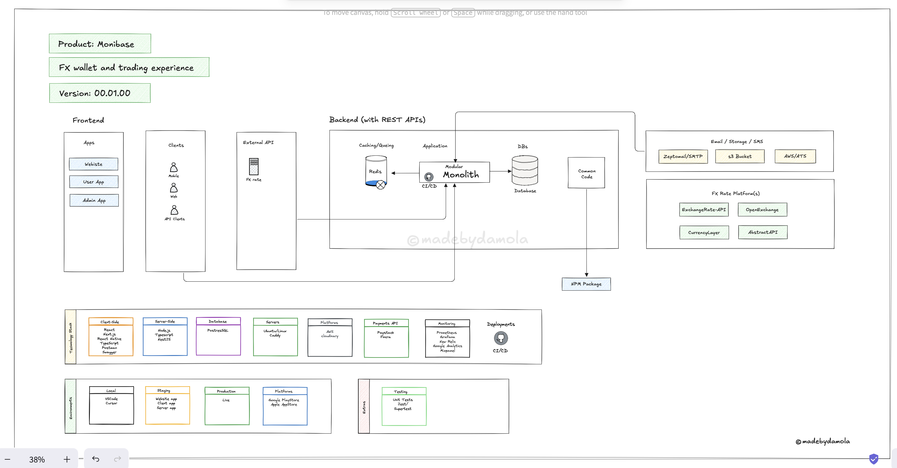
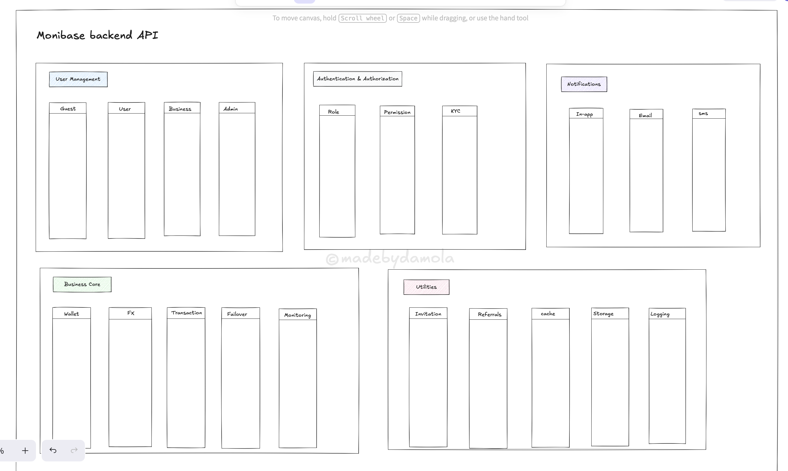
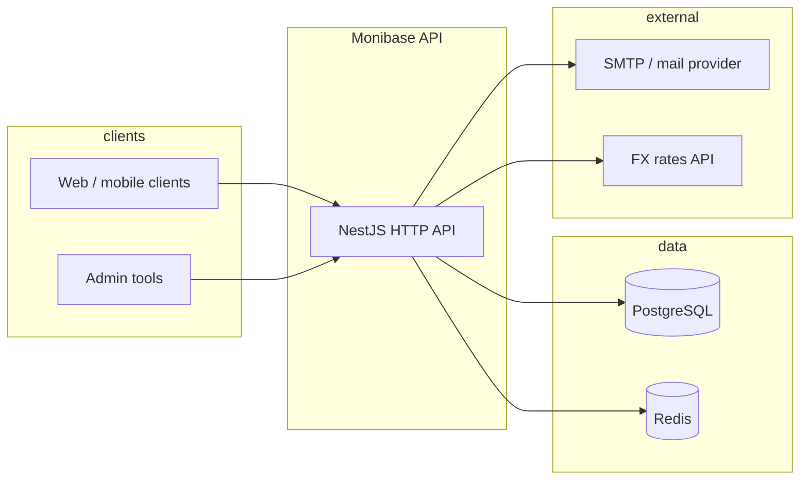
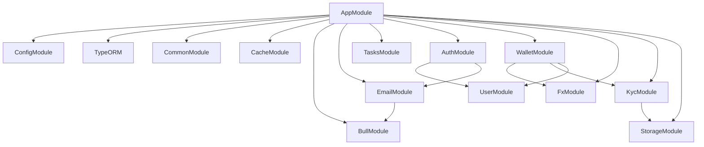
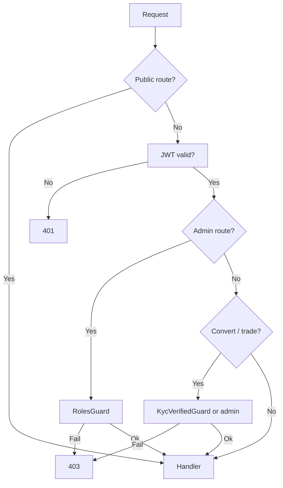
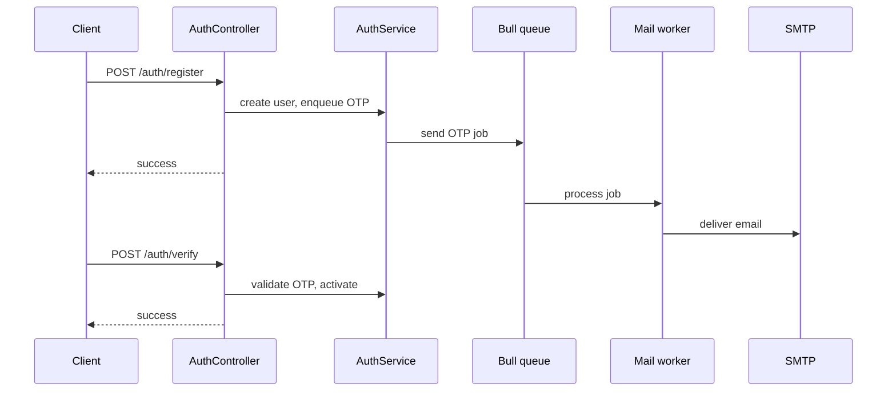
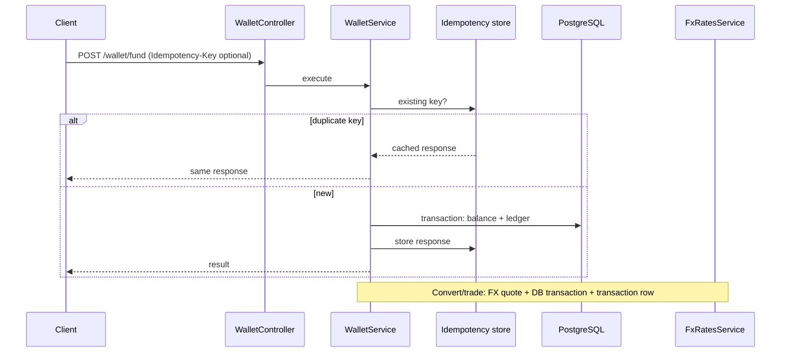
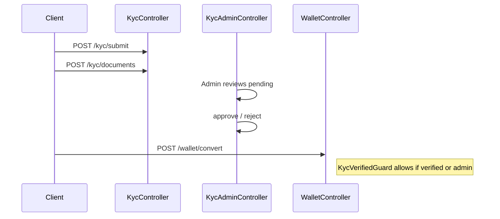
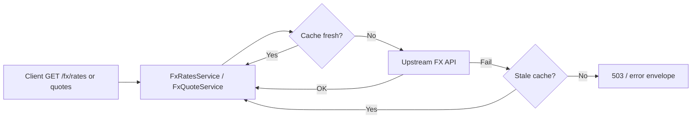

# Monibase – System Architecture

This document describes how the Monibase FX trading API is structured: runtime components, domain modules, data model, and major request flows. For setup and API details, see [README.md](./README.md).

## Visual architecture

High-level diagrams (hand-drawn references). Some labels describe the broader product or target stack; the sections below document the current NestJS API in this repo.

**FX wallet and trading experience** (clients, modular monolith, data stores, external FX and services, tech stack, environments):



**Backend API functional areas** (user management, auth, notifications, business core, utilities):



---

## 1. Architectural goals


| Goal                   | How it is addressed                                                                                   |
| ---------------------- | ----------------------------------------------------------------------------------------------------- |
| Correct money movement | TypeORM transactions, wallet repository patterns, idempotency records for fund/convert/trade/transfer |
| Compliance gates       | Email verification for wallet access; KYC (or admin role) for convert/trade                           |
| Resilient FX           | External rates API + in-memory cache + TTL; stale fallback when upstream fails                        |
| Observable operations  | Transaction ledger; audit events for auth, KYC, wallet mutations                                      |
| Safe APIs              | Global JWT guard (public routes opted out), throttling, role-based admin routes                       |


---

## 2. System context

External actors and systems the application depends on.




---

## 3. Containers (runtime)


| Container            | Responsibility                                                                 |
| -------------------- | ------------------------------------------------------------------------------ |
| **NestJS process**   | HTTP API, business logic, validation, orchestration                            |
| **PostgreSQL**       | Users, wallets, transactions, KYC, idempotency keys, audit-related persistence |
| **Redis**            | BullMQ job queue (e.g. OTP email); optional extension for distributed cache    |
| **Local filesystem** | KYC document uploads (`STORAGE_LOCAL_PATH`)                                    |


---

## 4. Application structure (modules)

High-level dependency view. Arrows show primary direction of use (not every import).




### Module responsibilities


| Module            | Role                                                                                               |
| ----------------- | -------------------------------------------------------------------------------------------------- |
| **CommonModule**  | Shared guards (JWT, roles, KYC-verified), decorators, middleware (device detection), query helpers |
| **AuthModule**    | Register, OTP verify, login/logout, JWT + Passport strategies                                      |
| **UserModule**    | Profile, deactivation, admin user listing                                                          |
| **EmailModule**   | Mail sending; queues outbound mail via Bull                                                        |
| **BullModule**    | Redis-backed queue wiring                                                                          |
| **TasksModule**   | Background workers (e.g. mail consumer)                                                            |
| **WalletModule**  | Balances, fund, convert, trade, transfer, transactions API, idempotency                            |
| **FxModule**      | Rate fetch, cache, quote services; public + admin FX controllers                                   |
| **KycModule**     | Submit, status, documents; admin review                                                            |
| **StorageModule** | File persistence for uploads                                                                       |
| **CacheModule**   | Application caching (e.g. profile)                                                                 |


### Global cross-cutting

- **JwtAuthGuard** (APP_GUARD): All routes require JWT unless marked `@Public()`.
- **ThrottlerGuard**: Rate limits per route/IP.
- **DeviceDetectionMiddleware**: Applied to all routes.

---

## 5. Domain model (logical)

```mermaid
erDiagram
  User ||--o{ WalletBalance : has
  User ||--o| Kyc : has
  User ||--o{ Transaction : generates
  User ||--o{ IdempotencyRecord : may_use

  User {
    uuid id PK
    string email
    string role
    boolean emailVerified
    boolean isActive
  }

  WalletBalance {
    uuid id PK
    uuid userId FK
    string currency
    decimal amount
  }

  Transaction {
    uuid id PK
    uuid userId FK
    string type
    decimal amount
    json metadata
    timestamp createdAt
  }

  Kyc {
    uuid id PK
    uuid userId FK
    string status
  }

  IdempotencyRecord {
    uuid userId PK_FK
    string key PK
    jsonb response
  }
```


One logical wallet per user is represented by multiple **WalletBalance** rows (one per currency). **Transaction** records funding, conversion, trade, and transfer events for history and audit.

---

## 6. Access control layers




Email verification is enforced where the product requires it (wallet flows). **KycVerifiedGuard** restricts convert/trade for non-admin users.

---

## 7. Key sequences

### 7.1 Registration and OTP




### 7.2 Fund / convert with idempotency




### 7.3 KYC and trading gate




---

## 8. FX rate pipeline




---

## 9. Deployment considerations

- **Single logical region**: One API + one primary Postgres; scale horizontally only with shared DB and Redis (queue must remain single consumer semantics per job type or use distributed locks where needed).
- **Production DB**: Disable TypeORM `synchronize`; use migrations.
- **Secrets**: JWT secret, DB password, mail credentials, FX API key via environment (validated at boot via Joi).
- **Observability**: Extend with structured logging, metrics, and tracing; audit trail already supports compliance review.

